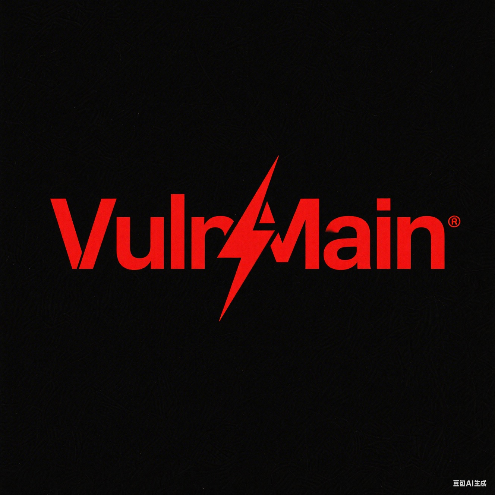
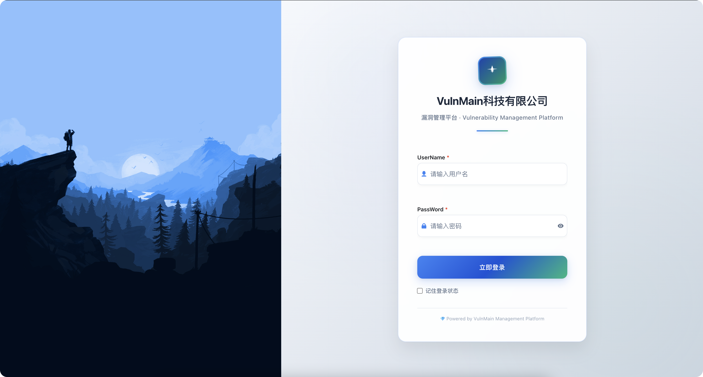
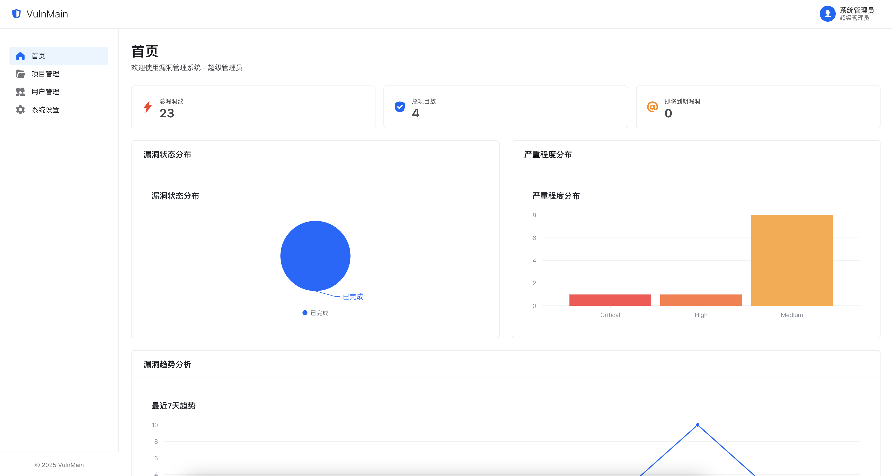
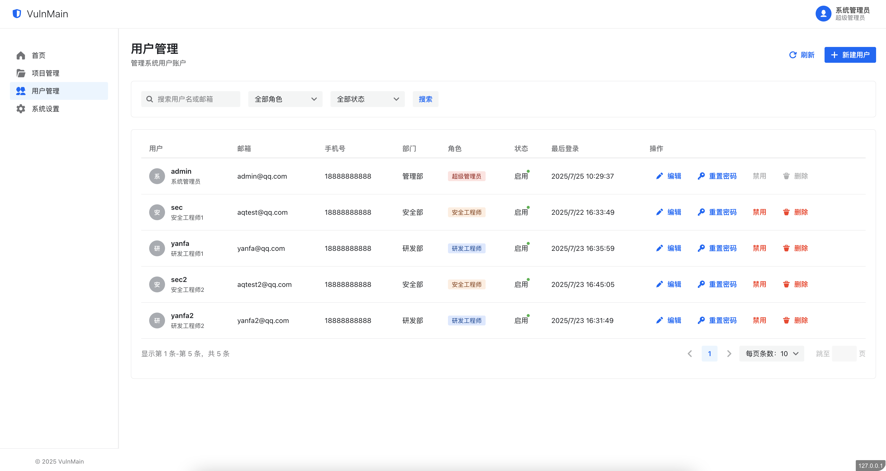
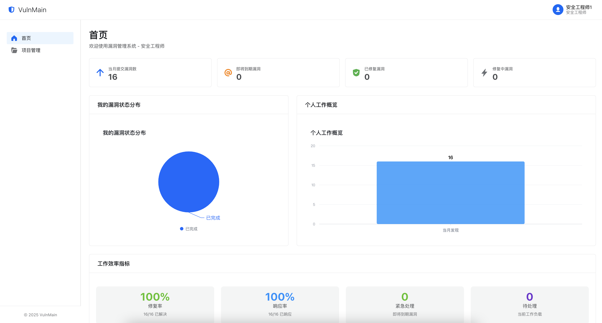
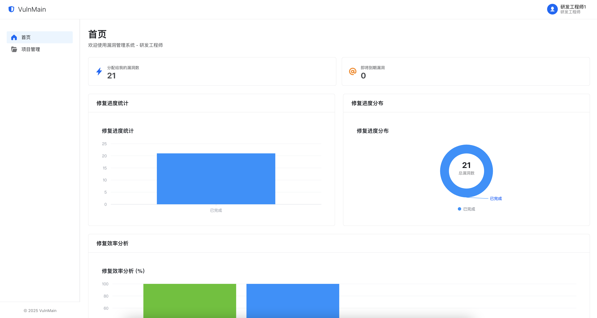
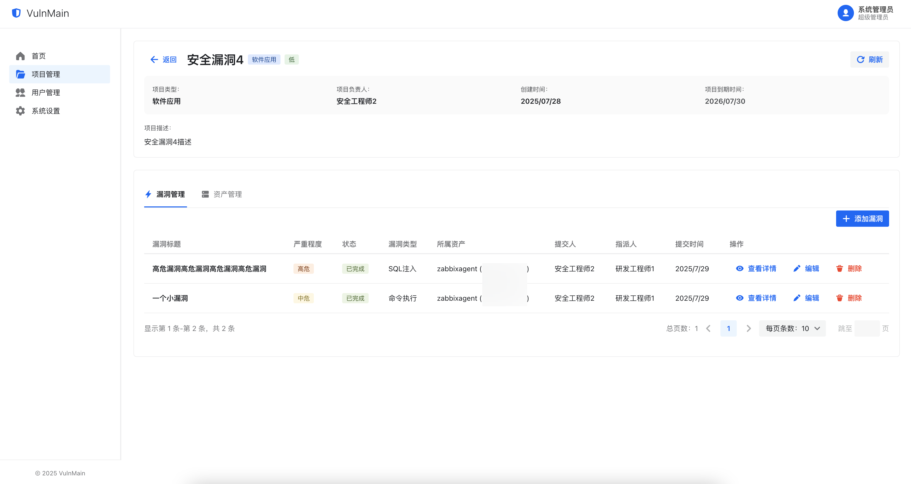
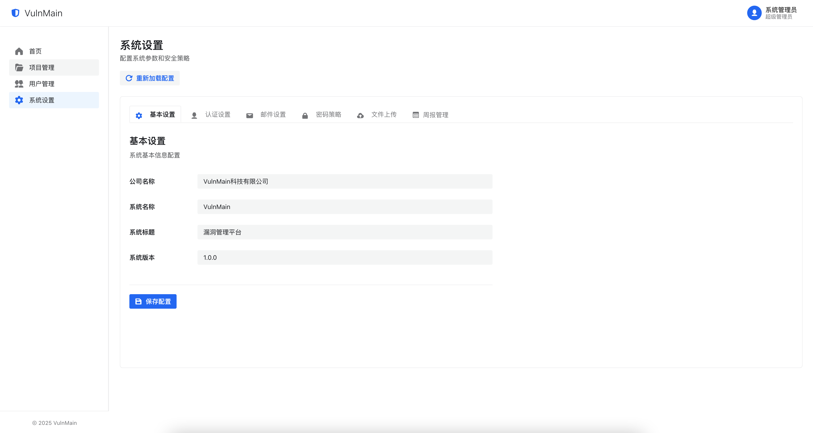
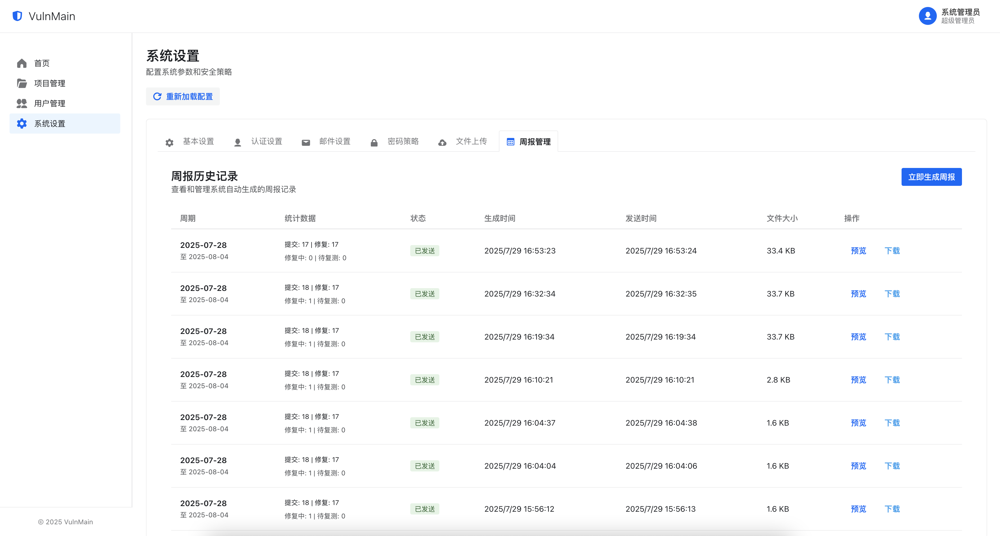
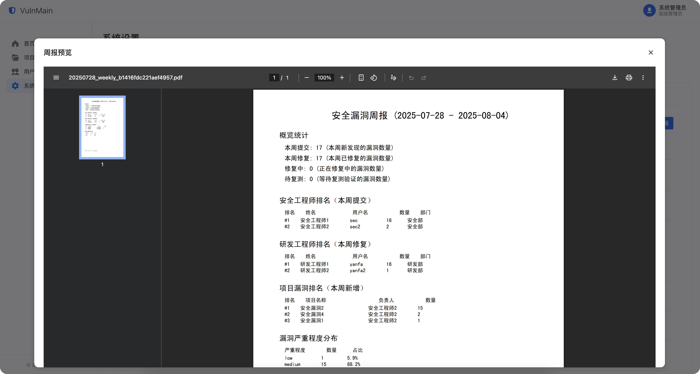

# VulnMain 漏洞管理系统

<div align="center">




</div>

> 🛡️ 一站式企业级漏洞管理与资产追踪平台，助力安全团队高效发现、跟踪与修复安全漏洞

## ✨ 项目简介

VulnMain 是一个基于现代化技术栈开发的企业级漏洞管理系统，采用 **Go (Gin) + Next.js** 架构，为安全团队和开发团队提供完整的漏洞生命周期管理解决方案。

### 🎯 核心价值

- **全流程管理**：从漏洞发现到修复验证的完整闭环
- **团队协作**：支持多角色权限管理，促进安全与开发团队协作
- **数据驱动**：丰富的统计分析功能，助力安全决策
- **现代化界面**：基于 Semi UI 的响应式设计，提供优秀的用户体验

## 🏗️ 系统架构

```
┌─────────────────┐    ┌─────────────────┐    ┌─────────────────┐
│   前端 (Web)    │    │   后端 (API)    │    │   数据库        │
│                 │    │                 │    │                 │
│  Next.js 14     │◄──►│  Go + Gin       │◄──►│  MySQL 5.7+     │
│  React 18       │    │  RESTful API    │    │                 │
│  Semi UI        │    │  JWT Auth       │    │                 │
│  TypeScript     │    │  GORM           │    │                 │
└─────────────────┘    └─────────────────┘    └─────────────────┘
```


**技术选型优势**：
- **前端**：Next.js + Semi UI，现代化响应式界面，支持 SSR
- **后端**：Go + Gin 框架，高性能 RESTful API
- **数据库**：MySQL，稳定可靠的关系型数据库
- **认证**：JWT 无状态认证

## 🚀 主要功能

### 核心功能模块

- 🛡️ **漏洞管理**：漏洞录入、分派、修复、验证全流程管理
- 📊 **数据分析**：仪表盘统计、趋势分析、报表生成
- 👥 **用户管理**：多角色权限控制，支持团队协作
- 🗂️ **周报统计**：周报数据自动统计
- 🔐 **安全认证**：JWT登录认证，会话管理
- 📝 **富文本编辑**：Markdown 漏洞描述编辑器

## 👥 权限管理体系

### 角色定义

| 角色 | 权限范围 | 主要职责 |
|------|----------|----------|
| 🔑 **超级管理员** | 全系统权限 | 系统配置、用户管理、项目管理 |
| 🛡️ **安全工程师** | 漏洞全流程管理 | 漏洞录入、分派、复测、验证 |
| 👨‍💻 **研发工程师** | 漏洞修复权限 | 漏洞修复、状态更新 |

### 权限细节

- **超级管理员**：可操作所有功能，添加项目、用户、修改系统配置等操作
- **安全工程师**：可操作项目资产录入、项目漏洞录入、漏洞分派、漏洞复测、漏洞验证全流程
- **研发工程师**：可操作漏洞修复、漏洞验证全流程
- **项目成员**：仅项目下的成员有权限查看项目详情、添加漏洞和添加资产

## 🚀 快速开始

### 环境要求

- **Go**: 1.22+
- **Node.js**: 16.0+
- **MySQL**: 5.7+ 或 8.0+
- **npm/yarn**: 最新版本

### 1. 📥 克隆项目

```bash
git clone https://github.com/VulnMain/VulnMainProject.git
cd VulnMain
```

### 2. 🗄️ 数据库配置

#### 创建数据库
```sql
CREATE DATABASE vulnmain CHARACTER SET utf8mb4 COLLATE utf8mb4_unicode_ci;
```

#### 配置连接信息
编辑 `config.yml` 文件：

```yaml
# 服务端口
server:
  port: 5000

# 数据库配置
datasource:
  driverName: mysql
  host: 127.0.0.1
  port: 3306
  database: vulnmain
  username: root
  password: your_password  # 请修改为实际密码
  charset: utf8
```

### 3. 🔧 启动后端服务

```bash
# 安装 Go 依赖
go mod tidy

# 启动后端服务
go run main.go
```

后端服务将在 `http://127.0.0.1:5000` 启动

### 4. 🌐 启动前端服务

```bash
# 进入前端目录
cd web

# 配置 API 地址
编辑 src/lib/api.ts 文件，将 NEXT_PUBLIC_API_URL 改为后端服务启动地址，例如：http://localhost:5000/api

# 安装依赖
npm install

# 构建生产版本
npm run build

# 使用 nginx 或其他 web 服务器启动
```

### 5. 🎉 系统初始化

**默认管理员账号**：
- 用户名：`admin`
- 密码：`admin123`

**访问地址**：
- 前端界面: [http://127.0.0.1](http://127.0.0.1)
- 后端 API: [http://127.0.0.1:5000](http://127.0.0.1:5000)

> 💡 **提示**: 首次启动时，系统会自动创建数据库表结构

## 📸 系统预览

### 🔐 登录界面


### 📊 仪表盘


### 🗂️ 项目管理


### 👥 用户管理


### 🛡️ 安全工程师视角


### 👨‍💻 研发工程师视角


### 👨‍💻 项目详情


### 👨‍💻 系统设置


### 👨‍💻 周报管理


### 👨‍💻 周报预览


## 🛠️ 技术栈详情

### 后端技术栈

| 技术 | 版本 | 用途 | 特点 |
|------|------|------|------|
| **Go** | 1.22+ | 核心语言 | 高性能、并发友好 |
| **Gin** | 1.10+ | Web 框架 | 轻量级、高性能 |
| **GORM** | 1.9+ | ORM 框架 | 功能丰富、易用 |
| **Viper** | 1.20+ | 配置管理 | 多格式支持 |
| **JWT-Go** | 3.2+ | 身份认证 | 无状态认证 |
| **MySQL Driver** | 1.6+ | 数据库驱动 | 稳定可靠 |

### 前端技术栈

| 技术 | 版本 | 用途 | 特点 |
|------|------|------|------|
| **Next.js** | 14.2+ | React 框架 | SSR、性能优化 |
| **React** | 18+ | UI 库 | 组件化开发 |
| **TypeScript** | 5+ | 类型系统 | 类型安全 |
| **Semi UI** | 2.83+ | 组件库 | 企业级设计 |
| **Axios** | 1.6+ | HTTP 客户端 | 请求拦截、响应处理 |
| **React Markdown** | 10+ | Markdown 渲染 | 富文本支持 |


## 📞 联系与支持

### 获取帮助

- 🐛 **问题反馈**: [GitHub Issues](https://github.com/VulnMain/VulnMainProject/issues)
- 💬 **讨论交流**: 沟通交流群（待定）


## 📄 许可证

本项目采用 [Apache License 2.0](http://www.apache.org/licenses/LICENSE-2.0) 开源协议。

Licensed under the Apache License, Version 2.0 (the "License"); you may not use this file except in compliance with the License. You may obtain a copy of the License at

http://www.apache.org/licenses/LICENSE-2.0

Unless required by applicable law or agreed to in writing, software distributed under the License is distributed on an "AS IS" BASIS, WITHOUT WARRANTIES OR CONDITIONS OF ANY KIND, either express or implied. See the License for the specific language governing permissions and limitations under the License.

---

<div align="center">

**如果这个项目对您有帮助，请给本项目一个 ⭐ Star！**

Made with ❤️ by VulnMain Team

</div>