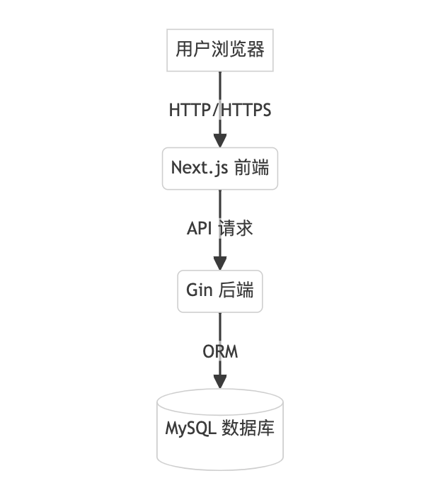
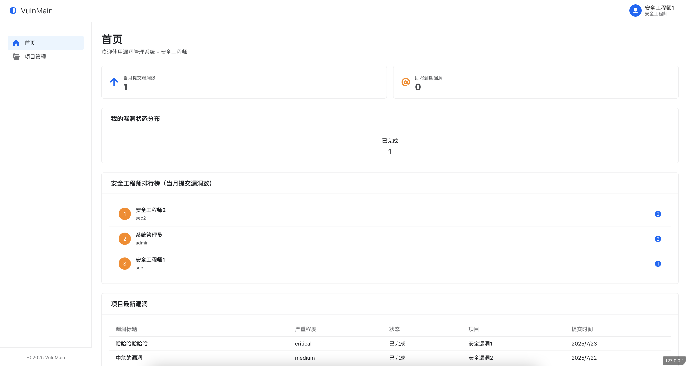
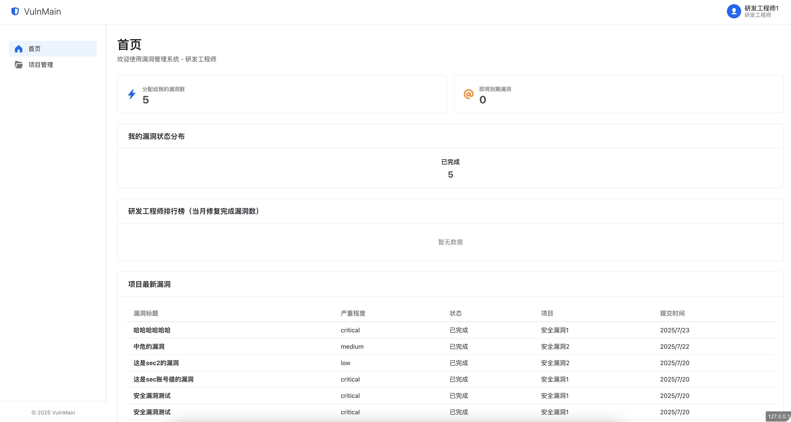

# VulnMain 漏洞管理系统


> 一站式漏洞管理与资产追踪平台，助力企业高效发现、跟踪与修复安全漏洞。

---

## 项目简介

VulnMain 是基于 Go（Gin）+ Next.js 技术栈开发的企业级漏洞管理系统，支持漏洞收集、分派、修复、统计分析等全流程管理，适用于安全团队、开发团队协作。

---

## 系统架构

- **前端**：Next.js + Semi UI，现代化响应式界面
- **后端**：Go + Gin，RESTful API
- **数据库**：MySQL

---

## 主要功能

- 🛡️ 漏洞录入、分派、修复、验证全流程
- 📊 仪表盘统计与趋势分析
- 👥 用户、角色与权限管理
- 🗂️ 资产管理与项目归档
- 🔒 JWT 登录认证
- 📝 Markdown 漏洞描述编辑器

---


## 业务逻辑

- 角色类型分为超级管理员、安全工程师、研发工程师
- 超级管理员权限：可操作所有功能，添加项目、用户、修改系统配置等操作。可以添加项目漏洞、项目资产、项目成员
- 安全工程师权限：可操作项目资产录入、项目漏洞录入、漏洞分派、漏洞复测、漏洞验证全流程
- 研发工程师权限：可操作漏洞修复、漏洞验证全流程
- 仅项目下的成员有权限查看项目详情、添加漏洞和添加资产

---

## 目录结构

```
VulnMain/
├── main.go                # Go 后端入口
├── config.yml             # 后端配置文件
├── models/                # 数据模型
├── routers/               # 路由与API
├── services/              # 业务逻辑
├── middleware/            # 中间件
├── utils/                 # 工具函数
├── web/                   # Next.js 前端
│   ├── public/            # 前端静态资源
│   └── src/               # 前端源码
└── uploads/               # 上传文件
```

---

## 2.0更新预告

```
增加知识库功能（优先级中）
增加域控登录功能（优先级中）
增加邮件通知功能（优先级中）
增加API接口KEY功能（优先级低）
```

---

## 快速开始

### 1. 克隆项目

```bash
git clone https://github.com/VulnMain/VulnMainProject.git
cd VulnMain
```

### 2. 配置数据库

编辑 `config.yml`：

```yaml
server:
  port : 5000

datasource:
  driverName : mysql
  host : 127.0.0.1
  port : 3306
  database : vulnmain
  username : root
  password : 123456
  charset : utf8
```

### 3. 启动后端

```bash
go mod tidy
go run main.go
```

### 4. 启动前端

```bash
cd web

编辑src/lib/api.ts文件，将NEXT_PUBLIC_API_URL改为后端服务启动地址

npm install

npm run build

使用nginx启动
```

### 5. 初始化

```bash
初始管理员账号：admin
初始管理员密码：admin123
```

前端默认访问地址：[http://127.0.0.1](http://127.0.0.1)

---

## 页面预览

### 登录页


### 仪表盘


### 项目管理


### 用户管理


### 安全工程师视角


### 研发工程师视角


---

## 联系与支持

- Issues: [https://github.com/VulnMain/VulnMainProject/issues](https://github.com/VulnMain/VulnMainProject/issues)

- 沟通交流群（待定）

---

## License

Except as otherwise noted this software is licensed under the Apache License, Version 2.0

For additional information regarding the source of included projects and the corresponding licenses, you may visit the following website

Licensed under the Apache License, Version 2.0 (the "License"); you may not use this file except in compliance with the License. You may obtain a copy of the License at

http://www.apache.org/licenses/LICENSE-2.0

Unless required by applicable law or agreed to in writing, software distributed under the License is distributed on an "AS IS" BASIS, WITHOUT WARRANTIES OR CONDITIONS OF ANY KIND, either express or implied. See the License for the specific language governing permissions and limitations under the License.

---