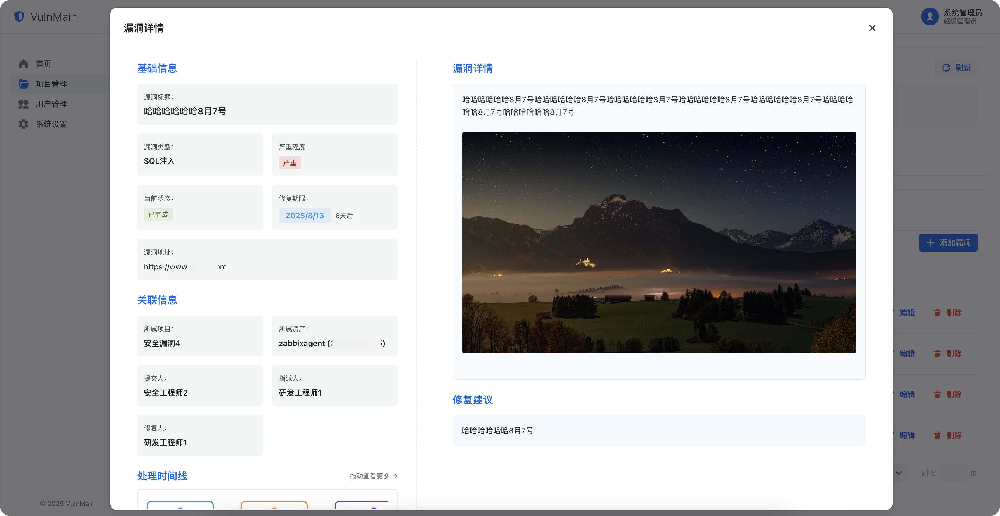

# VulnMain 漏洞管理系统

<div align="center">


</div>

> 🛡️ 一站式企业级漏洞管理与资产追踪平台，助力安全团队高效发现、跟踪与修复安全漏洞

## ✨ 项目简介

VulnMain 是一个基于现代化技术栈开发的企业级漏洞管理系统，采用 **Go (Gin) + Next.js** 架构，为安全团队和开发团队提供完整的漏洞生命周期管理解决方案。

### 🎯 核心价值

- **全流程管理**：从漏洞发现到修复验证的完整闭环
- **团队协作**：支持多角色权限管理，促进安全与开发团队协作
- **数据驱动**：丰富的统计分析功能，助力安全决策
- **现代化界面**：基于 Semi UI 的响应式设计，提供优秀的用户体验

## 🏗️ 系统架构

```
┌─────────────────┐    ┌─────────────────┐    ┌─────────────────┐
│   前端 (Web)    │    │   后端 (API)    │    │   数据库        │
│                 │    │                 │    │                 │
│  Next.js 14     │◄──►│  Go + Gin       │◄──►│  MySQL 5.7+     │
│  React 18       │    │  RESTful API    │    │                 │
│  Semi UI        │    │  JWT Auth       │    │                 │
│  TypeScript     │    │  GORM           │    │                 │
└─────────────────┘    └─────────────────┘    └─────────────────┘
```


**技术选型优势**：
- **前端**：Next.js + Semi UI，现代化响应式界面，支持 SSR
- **后端**：Go + Gin 框架，高性能 RESTful API
- **数据库**：MySQL，稳定可靠的关系型数据库
- **认证**：JWT 无状态认证，支持分布式部署

## 🚀 主要功能

### 🛡️ 漏洞管理模块

#### 漏洞生命周期管理
- **漏洞录入**：支持手动录入和批量导入，包含漏洞详情、截图、附件等
- **漏洞分类**：按照漏洞类型、严重程度、影响范围进行分类管理
- **漏洞分派**：智能分派给相应的研发工程师，支持自定义分派规则
- **修复跟踪**：实时跟踪修复进度，支持修复状态更新和进度汇报
- **复测验证**：安全工程师对修复结果进行复测，确保漏洞彻底修复
- **状态流转**：完整的状态流转机制（待修复→修复中→已修复→复测中→已关闭）

#### 漏洞详情管理
- **富文本描述**：基于 Markdown 的漏洞描述编辑器，支持代码高亮
- **图片管理**：漏洞截图上传、预览、批量管理，支持图片查看器
- **时间线追踪**：完整记录漏洞处理过程中的每个操作节点

### 📊 数据分析与报表

#### 仪表盘统计
- **实时概览**：漏洞总数、待修复数量、修复率等关键指标
- **趋势分析**：漏洞发现趋势、修复效率趋势、团队工作量分析
- **分类统计**：按漏洞类型、严重程度、项目维度的统计分析
- **团队绩效**：各团队成员的工作量统计和效率分析

#### 自动化报表
- **周报生成**：每周五自动生成并发送周报至管理员邮箱
- **PDF 导出**：支持将报表导出为 PDF 格式，便于存档和分享
- **历史记录**：完整的报表历史记录，支持在线预览和下载

### 👥 用户与权限管理

#### 用户管理
- **用户信息**：完整的用户档案管理，包含基本信息、联系方式、部门等
- **角色分配**：灵活的角色权限体系，支持超级管理员、安全工程师、研发工程师
- **状态管理**：用户状态控制，支持启用/禁用账户

#### 权限控制
- **细粒度权限**：基于功能模块的细粒度权限控制
- **项目权限**：项目级别的权限隔离，确保数据安全
- **操作审计**：完整的操作日志记录，支持权限变更追踪

### 🗂️ 项目与资产管理

#### 项目管理
- **项目创建**：支持创建多个独立项目，实现项目级别的数据隔离
- **成员管理**：灵活的项目成员管理，支持添加/移除项目成员
- **项目统计**：项目维度的漏洞统计和资产统计
- **项目配置**：项目级别的配置管理，包含项目描述、负责人等

#### 资产管理
- **资产录入**：支持手动录入和批量导入资产信息
- **资产分组**：按照业务线、技术栈等维度对资产进行分组管理
- **资产关联**：资产与漏洞的关联关系管理
- **导入导出**：支持 Excel 格式的资产批量导入导出

###  通知与提醒系统

#### 邮件通知
- **截止提醒**：漏洞修复截止期前1-3天自动发送邮件提醒
- **状态变更**：漏洞状态变更时自动通知相关人员
- **周报推送**：每周五自动生成并推送周报
- **系统通知**：重要系统事件的邮件通知

#### 站内通知
- **实时通知**：基于 WebSocket 的实时通知推送
- **通知中心**：统一的通知管理中心，支持已读/未读状态
- **通知分类**：按照通知类型进行分类管理

### 🔐 安全与认证

#### 身份认证
- **JWT 认证**：基于 JWT 的无状态身份认证
- **会话管理**：安全的会话管理机制，支持自动续期
- **密码策略**：可配置的密码强度策略
- **登录保护**：支持登录失败锁定等安全机制

#### 数据安全
- **权限隔离**：严格的数据权限隔离，确保数据安全
- **操作审计**：完整的操作日志记录，支持安全审计
- **文件安全**：上传文件的安全检查和存储管理

### ⚙️ 系统配置与管理

#### 系统设置
- **基础配置**：系统名称、Logo、联系方式等基础信息配置
- **邮件配置**：SMTP 邮件服务器配置，支持测试连接
- **密码策略**：密码复杂度、有效期等安全策略配置
- **系统维护**：系统备份、日志清理等维护功能

#### 数据字典
- **漏洞类型**：可配置的漏洞类型字典
- **严重程度**：漏洞严重程度等级定义
- **状态定义**：漏洞处理状态的标准化定义

## 🎯 功能特性一览

| 功能模块 | 功能特性 | 支持程度 | 说明 |
|---------|---------|---------|------|
| **漏洞管理** | 漏洞录入 | ✅ 完全支持 | 手动录入、批量导入 |
| | 漏洞分派 | ✅ 完全支持 | 智能分派、手动分派 |
| | 状态流转 | ✅ 完全支持 | 完整生命周期管理 |
| | 复测验证 | ✅ 完全支持 | 安全工程师复测机制 |
| | 时间线追踪 | ✅ 完全支持 | 完整操作历史记录 |
| **数据分析** | 实时统计 | ✅ 完全支持 | 多维度数据统计 |
| | 趋势分析 | ✅ 完全支持 | 图表化趋势展示 |
| | 自动周报 | ✅ 完全支持 | PDF 格式周报生成 |
| | 自定义报表 | ✅ 完全支持 | 灵活的报表配置 |
| **用户管理** | 多角色权限 | ✅ 完全支持 | 三级角色权限体系 |
| | 用户档案 | ✅ 完全支持 | 完整用户信息管理 |
| | 权限审计 | ✅ 完全支持 | 操作日志记录 |
| **项目管理** | 项目隔离 | ✅ 完全支持 | 项目级数据隔离 |
| | 成员管理 | ✅ 完全支持 | 灵活的成员权限 |
| | 项目统计 | ✅ 完全支持 | 项目维度数据分析 |
| **资产管理** | 资产录入 | ✅ 完全支持 | 手动录入、批量导入 |
| | 资产分组 | ✅ 完全支持 | 多维度分组管理 |
| | 导入导出 | ✅ 完全支持 | Excel 格式支持 |
| **通知系统** | 邮件通知 | ✅ 完全支持 | 自动化邮件提醒 |
| | 站内通知 | ✅ 完全支持 | 实时通知推送 |
| | 截止提醒 | ✅ 完全支持 | 智能截止期提醒 |
| **系统配置** | 基础设置 | ✅ 完全支持 | 系统信息配置 |
| | 邮件配置 | ✅ 完全支持 | SMTP 服务器配置 |
| | 安全策略 | ✅ 完全支持 | 密码策略配置 |

## 👥 权限管理体系

### 角色定义

| 角色 | 权限范围 | 主要职责 |
|------|----------|----------|
| 🔑 **超级管理员** | 全系统权限 | 系统配置、用户管理、项目管理 |
| 🛡️ **安全工程师** | 漏洞全流程管理 | 漏洞录入、分派、复测、验证 |
| 👨‍💻 **研发工程师** | 漏洞修复权限 | 漏洞修复、状态更新 |

### 权限细节

- **超级管理员**：可操作所有功能，添加项目、用户、修改系统配置等操作
- **安全工程师**：可操作项目资产录入、项目漏洞录入、漏洞分派、漏洞复测、漏洞验证全流程
- **研发工程师**：可操作漏洞修复、漏洞验证全流程
- **项目成员**：仅项目下的成员有权限查看项目详情、添加漏洞和添加资产

## 🚀 快速开始

### 环境要求

- **Go**: 1.22+
- **Node.js**: 16.0+
- **MySQL**: 5.7+ 或 8.0+
- **npm/yarn**: 最新版本

### 1. 📥 克隆项目

```bash
git clone https://github.com/VulnMain/VulnMainProject.git
cd VulnMain
```

### 2. 🗄️ 数据库配置

#### 创建数据库
```sql
CREATE DATABASE vulnmain CHARACTER SET utf8mb4 COLLATE utf8mb4_unicode_ci;
```

#### 配置连接信息
编辑 `config.yml` 文件：

```yaml
# 服务端口
server:
  port: 5000

# 数据库配置
datasource:
  driverName: mysql
  host: 127.0.0.1
  port: 3306
  database: vulnmain
  username: root
  password: your_password  # 请修改为实际密码
  charset: utf8
```

### 3. 🔧 启动后端服务

```bash
# 安装 Go 依赖
go mod tidy

# 启动后端服务
go run main.go
```

后端服务将在 `http://127.0.0.1:5000` 启动

### 4. 🌐 启动前端服务

```bash
# 进入前端目录
cd web

# 配置 API 地址
编辑 src/lib/api.ts 文件，将 NEXT_PUBLIC_API_URL 改为后端服务启动地址，例如：http://localhost:5000/api

# 安装依赖
npm install

# 构建生产版本
npm run build

# 使用 nginx 或其他 web 服务器启动
```

### 5. 🎉 系统初始化

**默认管理员账号**：
- 用户名：`admin`
- 密码：`admin123`

**访问地址**：
- 前端界面: [http://127.0.0.1](http://127.0.0.1)
- 后端 API: [http://127.0.0.1:5000](http://127.0.0.1:5000)

> 💡 **提示**: 首次启动时，系统会自动创建数据库表结构

## 📸 系统预览

### 🔐 登录界面


### 📊 仪表盘


### 🗂️ 项目管理


### 👥 用户管理


### 🛡️ 安全工程师视角


### 🛡️ 漏洞详情


### 👨‍💻 研发工程师视角


### 👨‍💻 项目详情


### 👨‍💻 系统设置


### 👨‍💻 周报管理


### 👨‍💻 周报预览


## 系统工作流程

### 典型使用场景

#### 场景一：安全工程师发现漏洞
1. **登录系统** → 使用安全工程师账号登录
2. **选择项目** → 进入相应的项目管理页面
3. **录入漏洞** → 填写漏洞详情、上传截图、设置严重程度
4. **分派漏洞** → 选择合适的研发工程师进行分派
5. **跟踪进度** → 通过仪表盘和通知系统跟踪修复进度
6. **复测验证** → 研发修复后进行复测验证
7. **关闭漏洞** → 确认修复后关闭漏洞

#### 场景二：研发工程师修复漏洞
1. **接收通知** → 收到漏洞分派的邮件通知
2. **查看详情** → 登录系统查看漏洞详细信息
3. **确认漏洞** → 分析漏洞并确认修复方案
4. **修复漏洞** → 进行代码修复和测试
5. **更新状态** → 更新漏洞状态为已修复
6. **等待复测** → 等待安全工程师复测验证

#### 场景三：管理员查看报表
1. **登录系统** → 使用管理员账号登录
2. **查看仪表盘** → 查看系统整体统计数据
3. **生成报表** → 按需生成各类统计报表
4. **接收周报** → 每周五自动接收系统周报
5. **系统配置** → 根据需要调整系统配置

## 🛠️ 技术栈详情

### 后端技术栈

| 技术 | 版本 | 用途 | 特点 |
|------|------|------|------|
| **Go** | 1.22+ | 核心语言 | 高性能、并发友好 |
| **Gin** | 1.10+ | Web 框架 | 轻量级、高性能 |
| **GORM** | 1.9+ | ORM 框架 | 功能丰富、易用 |
| **Viper** | 1.20+ | 配置管理 | 多格式支持 |
| **JWT-Go** | 3.2+ | 身份认证 | 无状态认证 |
| **MySQL Driver** | 1.6+ | 数据库驱动 | 稳定可靠 |

### 前端技术栈

| 技术 | 版本 | 用途 | 特点 |
|------|------|------|------|
| **Next.js** | 14.2+ | React 框架 | SSR、性能优化 |
| **React** | 18+ | UI 库 | 组件化开发 |
| **TypeScript** | 5+ | 类型系统 | 类型安全 |
| **Semi UI** | 2.83+ | 组件库 | 企业级设计 |
| **Axios** | 1.6+ | HTTP 客户端 | 请求拦截、响应处理 |
| **React Markdown** | 10+ | Markdown 渲染 | 富文本支持 |


## 📞 联系与支持

### 获取帮助

- 🐛 **问题反馈**: [GitHub Issues](https://github.com/VulnMain/VulnMainProject/issues)
- 💬 **讨论交流**: 沟通交流群（待定）


## 📄 许可证

本项目采用 [Apache License 2.0](http://www.apache.org/licenses/LICENSE-2.0) 开源协议。

Licensed under the Apache License, Version 2.0 (the "License"); you may not use this file except in compliance with the License. You may obtain a copy of the License at

http://www.apache.org/licenses/LICENSE-2.0

Unless required by applicable law or agreed to in writing, software distributed under the License is distributed on an "AS IS" BASIS, WITHOUT WARRANTIES OR CONDITIONS OF ANY KIND, either express or implied. See the License for the specific language governing permissions and limitations under the License.

---

<div align="center">

**如果这个项目对您有帮助，请给本项目一个 ⭐ Star！**

Made with ❤️ by VulnMain Team

</div>